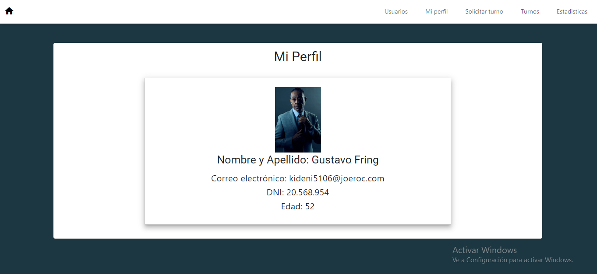
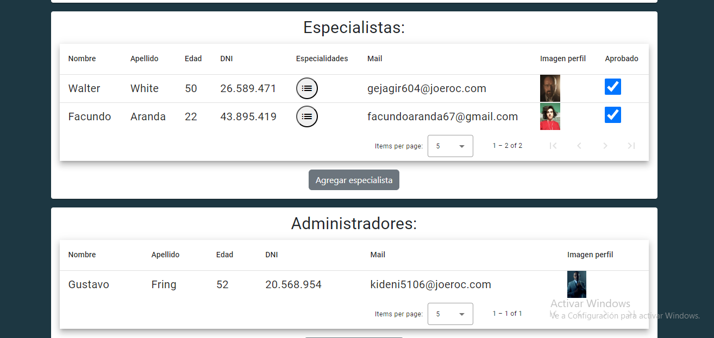
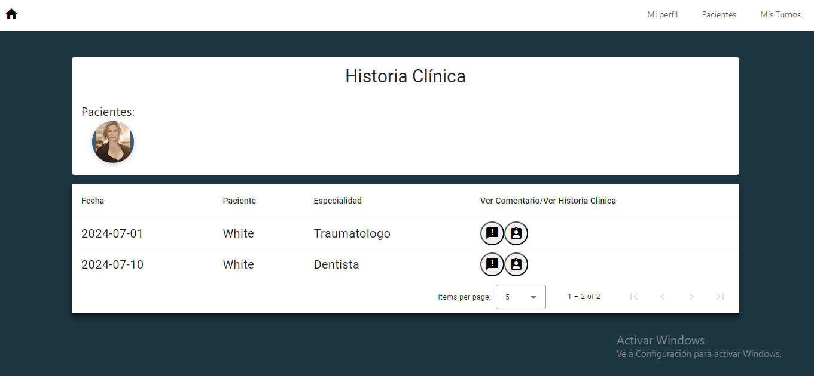

# Tp Clinica Aranda Facundo

Link de la página en Firebase: https://laboratorioivtpclinicaaranda.firebaseapp.com

## Alumno

Aranda Facundo

  
  

## Descripcion

La clinica Online es una página desarrollada con el objetivo de lograr una mayor eficiencia y comodidad a la hora de manejar los
datos referidos a pacientes, especialistas y administradores. Dentro de ella los pacientes seran capaces de reservar o cancelar un turno, chequear el estado de los mismos y revisar la historia clinica que realiza el especialista que lo atiende, ademas de dejar su reseña. Por el lado de los especialistas, estos podran manejar sus turnos con comodidad y tener a mano la historia clinica de su paciente siempre que lo necesite. Y no nos olvidemos las herramientas del administrador, el cual podra controlar el ingreso de especialistas al sistema, asi como tener acceso a todos los turnos, historias clinicas y mucho mas!

## Bienvenida
Es la pagina que da la bienvenida al usuario, en ella se puede elegir entre logearse, registrarse como paciente o registrarse como especialista

## Login
Por aqui ingresaran los usuarios al sistema, sin embargo estos tienen que haber validado su mail antes y, en el caso de los especialistas, deben ser aceptados por un administrador. Ademas, cuenta con 5 botones de ingreso rapido: 1 Admin, 2 Especialistas y 2 Pacientes

## Registro Paciente
Permite que un usuario se registre como paciente, debera cargar sus datos junto con dos imagenes, ademas de resolver un captcha

## Registro Especialista
Lo mismo que el registro de pacientes, solo que debera cargar una unica foto y las especialidades que maneja

## Mi Perfil
Muestra los datos del usuario, ademas, en el caso de los especialistas les permitira cargar sus horarios, mientras que los pacientes podran revisar su historia clinica

### Admin

### Especialista(Mis Turnos)

Cuenta con un apartado donde el especialista podra cargar sus horarios de trabajo asi como la especialidad que ejercera ese dia. Los horarios en los que puede elegir turno son de Lunes a Viernes de 8 a 19 y los Sabados de 8 a 14, ademas no puede tener consultas menores a media hora o mayores a una.

### Paciente(Historia Clinica)

Mostrara sus 2 imagenes, sus datos y su obra social. Ademas cuenta con una seccion donde puede ver la historia clinica, seleccionando al especialista que se la cargo previamente.

## Seccion usuarios

Solo la puede ver el Admin, dentro de ella tiene los datos de todos los usuarios, ademas de que puede registrar desde ahi ya sea a un paciente, un especialista o incluso otro admin. Cuenta con la posibilidad de aceptar o rechazar el ingreso de los especialistas al sistema. Tambien tiene una seccion donde, seleccionando previamente al paciente, puede ver su historia clinica y descargar un excel con los datos de esta. Tambien puede descargar un excel general de los usuarios.

## Solicitar Turno
Pueden realizarlo tanto el administrador como el paciente, en el caso del paciente este eligira primero al especialista y despues la especialidad con la cual quiere tratarse, en caso de que el especialista tenga horarios disponibles para esa especialidad el usuario podra sacar un turno. Por el lado del admin seria el mismo procedimiento salvo que ademas despues de elegir al especialista y su especialidad, tendra que elegir al paciente que se atenderá con el.

## Turnos
En este apartado, el admin podra ver el el estado de todos los turnos que se pidieron, y podra cancelar aquellos que todavia no hayan sido aceptados o rechazados, poniendo un comentario explicando el porque.

## Mis turnos
Seccion para los pacientes y para los especialistas, en la cual veran el estado de los turnos que les corresponden. El admin podra proceder a rechazar o aceptar los turnos pendientes y cancelarlos en caso de algun incoveniente, explicando el motivo. Ademas, al completar la consulta, este le podra cargar su historia clinica al paciente. El paciente por otro lado, al haber terminado su consulta, podra cargar una encuesta de su experiencia en la clinica y con el especialista en particular. 

## Filtro
Ya sea en la seccion "Turnos" o "Mis Turnos", se contara con un filtro en el cual se podra especificar: Especialidad, Especialista(En caso del paciente), Paciente(En caso del especialista),Fecha, Hora, Estado y, tanto para los Pacientes como para los Especialistas, se les permitira filtrar tambien por Historia Clinica 

## Pacientes
En esta sección el especialista podra seleccionar a alguno de los pacientes que atendio para ver su historia clinica

## Estadisticas

En esta seccion el administrador podra ver distintos tipos de estadisticas representadas en graficos, permitiendosele descargar un pdf con su informacion.

